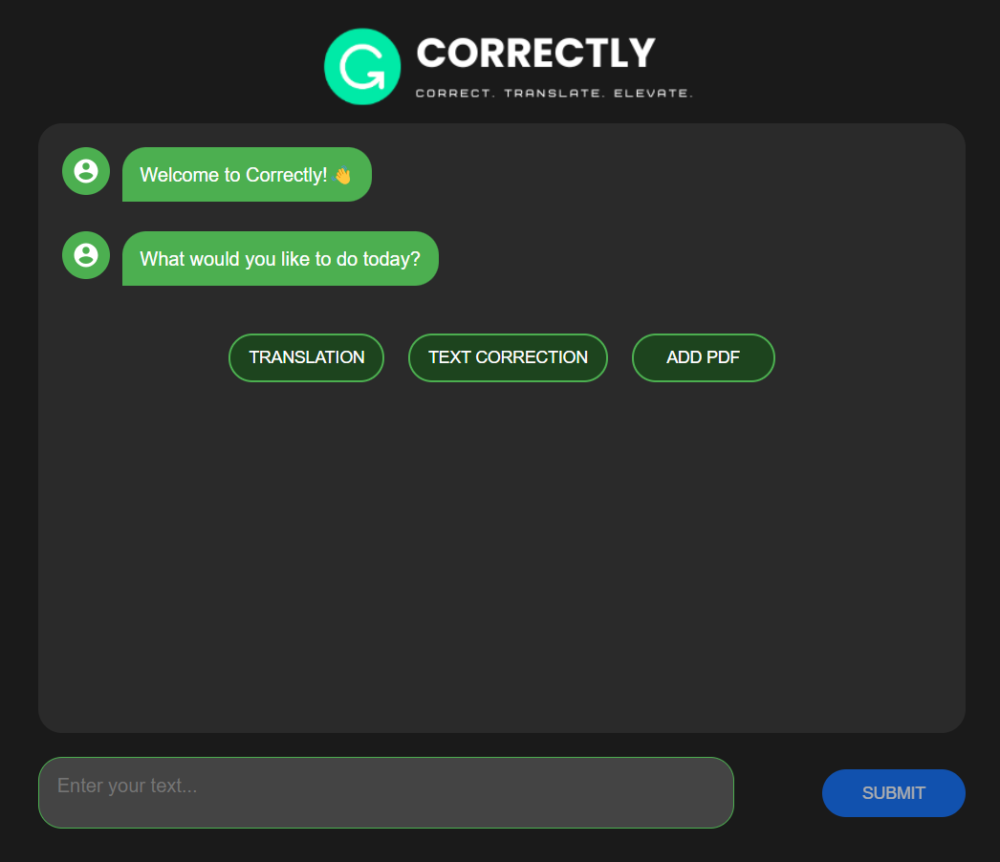

# Correctly_NLP 🚀

<p align="center">
  
</p>

## Table of Contents
- [Overview](#-overview)
- [Features](#-features)
- [Getting Started](#-getting-started)
- [Usage](#-usage)
- [Project Structure](#-project-structure)
- [Contributing](#-contributing)
- [License](#-license)
- [Contact](#-contact)
- [Acknowledgments](#-acknowledgments)

## 🌟 Overview

Correctly_NLP is an advanced Natural Language Processing tool designed to handle multilingual text processing, with a special focus on English and Arabic languages. This powerful tool provides capabilities for grammar, spelling  correction, translation, and PDF correction, making it an essential asset for linguists, developers, and language enthusiasts.

## ✨ Features

- 🔍 Grammar correction for multiple languages
- 🔄 Seamless translation between English and Arabic
- 📝 Advanced PDF correction and processing
- 🎯 Custom templates for common use cases
- 🛠️ User-friendly Python interface

## 🚀 Getting Started

### Prerequisites

- Python 3.x
- pip (Python package manager)

### Installation

1. Clone the repository:
```

git clone [https://github.com/malakaydi/Correctly_NLP.git]
cd Correctly_NLP

```

2. Install the required dependencies:
```

pip install -r requirements.txt

```

## 💻 Usage

### Basic Example

```
http://127.0.0.1:5000/spell
```
1. Navigate to the spell correction mode.
2. Select the language (English or Arabic).
3. Enter the text you want to correct in the provided text area.
4. Click "Submit" to see the corrected text.

### Translation

```
http://127.0.0.1:5000/translation
```
1. Navigate to the translation mode.
3. Select the source and target languages.
2. Enter the text you want to translate in the provided text area.
4. Click "submit" to see the translated text.

### Upload_PDF

```
http://127.0.0.1:5000/Upload_PDF
```
1. Navigate to the PDF correction mode.
2. Upload a PDF file using the file upload button.
3. Click "Process PDF" to correct and analyze the PDF content.
4. The corrected PDF will be downloaded to your local.


<p align="center">
  
</p>

## 🗂️ Project Structure

```
Correctly_NLP/
├── app.py                 # Main application file
├── arabic.py              # Arabic language processing
├── english.py             # English language processing
├── translation.py         # Translation functionality
├── Grammar Correction.csv # Grammar correction data
├── requirements.txt       # Project dependencies
├── static/                # Static resources
└── Culture/               # Cultural resources
└── templates/             # Template files
```

## 🤝 Contributing

We welcome contributions to Correctly_NLP! Here's how you can help:

1. Fork the project
2. Create your feature branch (`git checkout -b feature/AmazingFeature`)
3. Commit your changes (`git commit -m 'Add some AmazingFeature'`)
4. Push to the branch (`git push origin feature/AmazingFeature`)
5. Open a Pull Request


Please ensure your code adheres to the project's coding standards and includes appropriate tests.

## 📝 License

This project is licensed under the MIT License - see the [LICENSE](LICENSE) file for details.

## 📬 Contact

MalaK aidi - [@malakaydi](https://github.com/malakaydi)

Project Link: [https://github.com/malakaydi/Correctly_NLP](https://github.com/malakaydi/Correctly_NLP)

## 🙏 Acknowledgments

- Thanks to all contributors who have helped shape Correctly_NLP
- Special thanks to the open-source NLP community for their invaluable resources and tools
- Gratitude to all linguists and language experts who have provided insights and feedback


---

Made with ❤️ by Malak aidi & Rabeb Triki
